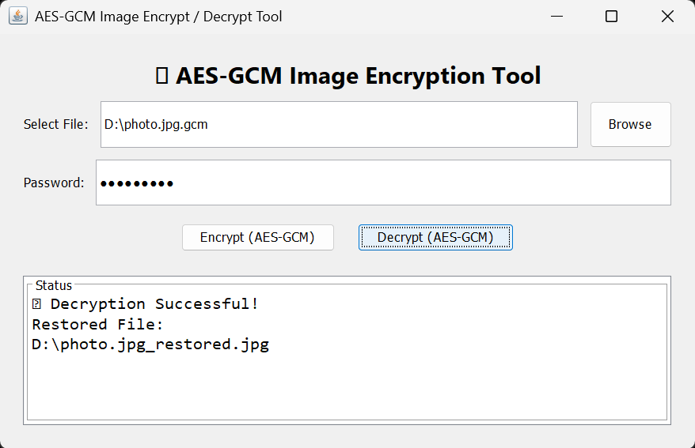

# 🔐 AES-GCM Image Encryption & Decryption Tool (Java GUI)

A modern **Windows desktop application** built using **Java Swing** that allows users to securely encrypt and decrypt image files using **AES-GCM**, an industry-standard encryption algorithm.

This project provides password-based file protection with a clean GUI interface and supports packaging into a standalone `.exe` using Launch4j.

---

## 🚀 Features

✅ Encrypt any image file securely using **AES-GCM**  
✅ Password-based encryption and decryption  
✅ Detects wrong password or modified file automatically  
✅ Modern Java Swing GUI  
✅ Generates encrypted `.gcm` files  
✅ Restores original image perfectly  
✅ Packaged into a Windows `.exe` using Launch4j  

---

## 🛡️ Encryption Standard Used

This project uses:

- **AES (Advanced Encryption Standard)**
- Mode: **GCM (Galois/Counter Mode)**
- Key: Password → SHA-256 → AES-128 Key
- Random IV generation for each encryption

AES-GCM is widely used in:

- HTTPS / TLS Security
- Banking Applications
- Cloud Storage Encryption
- Secure Messaging Systems

---

## 📂 Project Workflow

```
Original Image (photo.jpg)
        ↓ Encrypt (AES-GCM + Password)
Encrypted File (photo.jpg.gcm)
        ↓ Decrypt (Same Password)
Restored Image (photo_restored.jpg)
```

---

## 🖥️ Application Preview




- Browse image file
- Enter password
- Click Encrypt or Decrypt
- Output file is saved automatically

---

## ⚙️ How to Run the Project

### 1. Compile

```bash
javac AESGCMImageCipherGUI.java
```

### 2. Run

```bash
java AESGCMImageCipherGUI
```

---

## 📦 Packaging into EXE (Launch4j)

1. Convert `.java` → `.jar`
2. Open Launch4j
3. Select jar file
4. Set output file as `.exe`
5. Click ⚙ Build

Output:

```
AESGCMTool.exe
```

---

## 🛠️ Technologies Used

- Java
- Java Swing (GUI)
- AES-GCM Encryption (`javax.crypto`)
- File Handling (Streams)
- Launch4j (EXE Packaging)

---

## 📌 Future Enhancements

- Dark Mode UI
- Support all file types (PDF, ZIP, MP4)
- AES-256 with PBKDF2 + Salt
- Installer Setup (.msi)
- Progress Bar for large files

---

## 👨‍💻 Author

**Sanket Bhuite**  
B.Sc Computer Science Student  
Cybersecurity & Java Developer  

📌 Portfolio: https://myself-sanket.netlify.app/

---

## ⭐ If you like this project

Give it a ⭐ on GitHub and feel free to contribute!
